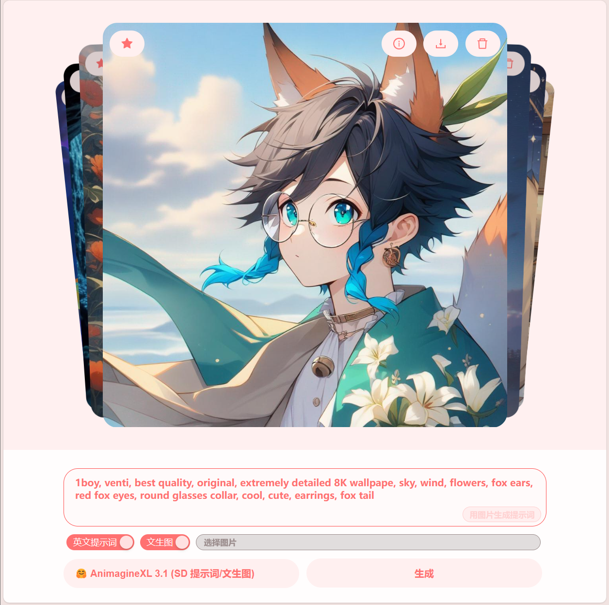
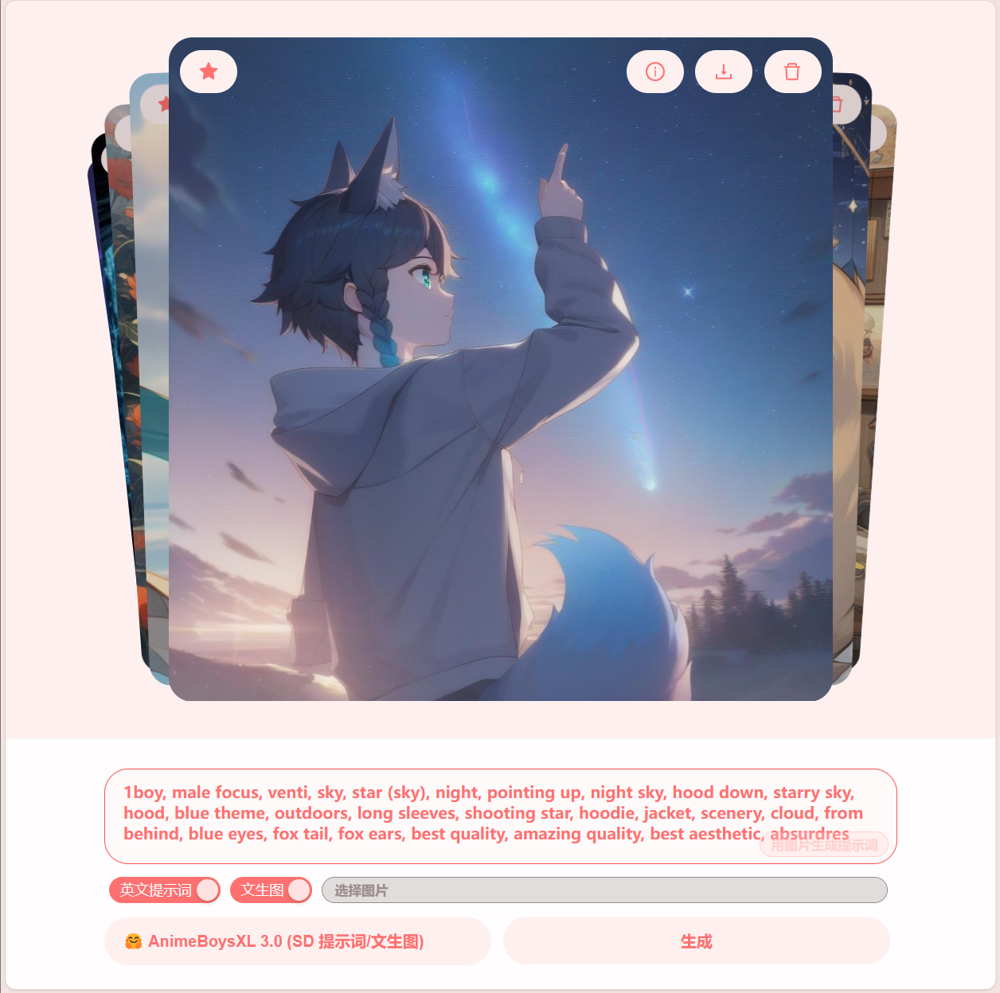
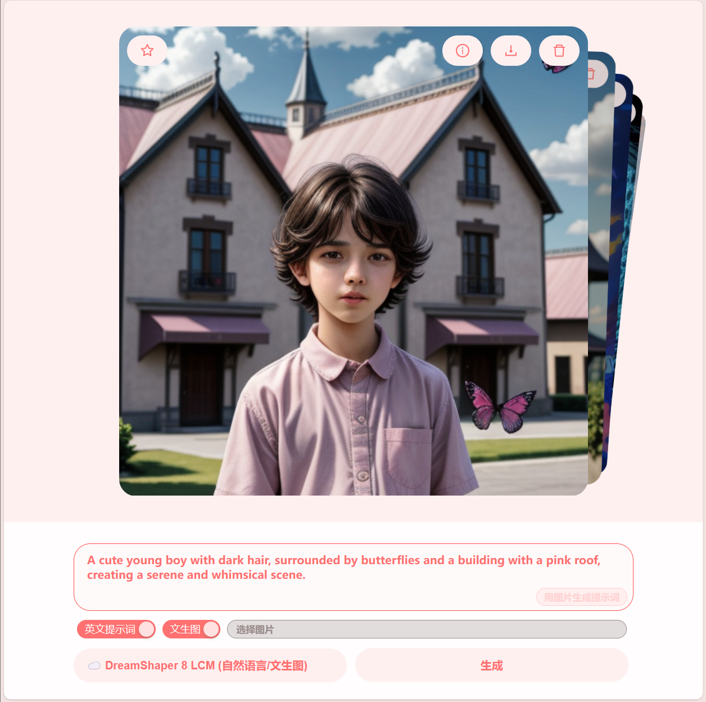

**[简体中文](README_ZH.md) | [正體中文](README_ZH_TW.md) | English**

# PainterLeaf
- Text-to-image, supports multiple models
- Image-to-text, convert local images to prompts
- Also supports image-to-image
- Prompt supports Chinese and English (Chinese will automatically call `AI` translation)
- Front-end and back-end separation, front-end based on `React`, back-end based on `Hono`, see [this project](https://github.com/LeafYeeXYZ/MyAPIs)
- `API` provided by `CloudflareAI` and `HuggingFace`
- Internationalization support, currently supports `Simplified Chinese`, `Traditional Chinese`, and `English`

|||
|:---:|:---:|

## Example
||||
|:---:|:---:|:---:|

## Usage
### Deploy Server
See [this project](https://github.com/LeafYeeXYZ/MyAPIs)

### Modify src/config.json
```javascript
{
  "SERVER": "https://api.xxx.workers.dev", // Your server address
}
```

### Install dependencies
```bash
npm i -g pnpm
pnpm i
```

### Local run
```bash
pnpm dev
```

### Build
```bash
pnpm build
```
