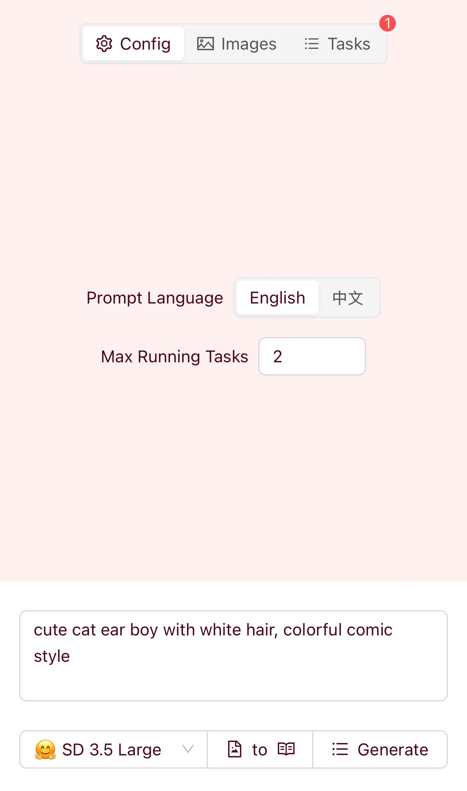
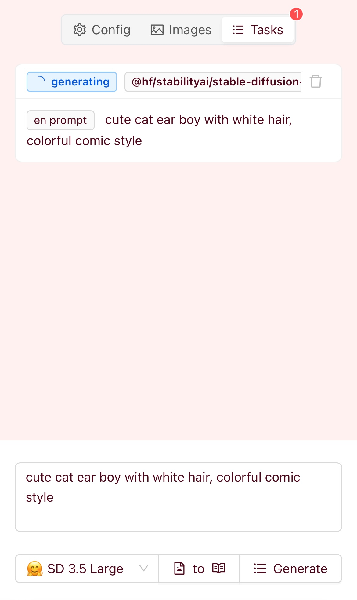

**For old version, see `v3` branch and <https://paint.leafyee.xyz>**

# Painter Leaf

- Text-to-image: supports multiple models
- Image-to-text: convert local images to prompts
- Prompt supports Chinese and English (Chinese will automatically call `AI` translation)
- `API` provided by `CloudflareAI` and `HuggingFace`

|  |  |  |
| :---: | :---: | :---: |

## Usage

### Config Environment Variables

You can use either `Fullstack` or `Client-Server` mode.

#### Fullstack

Set following environment variables in `.env` file or `Vercel`.

| Key | Value | Required |
| :---: | :---: | :---: |
| `CF_USER_ID` | `Cloudflare` user id | ✅ |
| `CF_AI_API_KEY` | `Cloudflare AI` api key | ✅ |
| `HF_API_KEY` | `HuggingFace` api key |  |

> The free plan of `Vercel` has a limit of 10s for each request, which may cause `504` error (especially when using `HuggingFace` models). You can subscribe to a `Vercel` paid plan, run the server locally, or use `Client-Server` mode. <span id="vervel-limit-resolution"></span>

#### Client-Server

Deploy the server to `Cloudflare Workers` (see [this project](https://github.com/LeafYeeXYZ/MyAPIs)) and set following environment variables in `.env` file or `Vercel`.

| Key | Value | Required |
| :---: | :---: | :---: |
| `NEXT_PUBLIC_WORKERS_SERVER` | `Server` url (e.g. `https://api.xxx.workers.dev`) | ✅ |

### Deploy

Deploy this project to `Vercel` (remember to set environment variables).

### Common Issues

- `429` error: You may have exceeded the `HuggingFace` api request limit. Please wait for a while, reduce the frequency of requests, and consider subscribing to a paid plan.
- `504` error: The request have exceeded the `Vercel` time limit. See [above](#vervel-limit-resolution) for resolution.

## Development

### Clone the repository

```bash
git clone https://github.com/LeafYeeXYZ/PainterLeaf.git
```

### Install dependencies

```bash
bun i
```

> If you haven't installed `Bun` yet, please refer to [Bun.sh](https://bun.sh).

### Local Development

```bash
bun dev
```

### Build

```bash
bun run build
```
