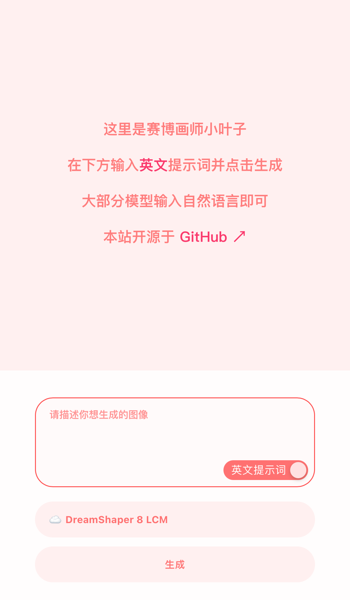
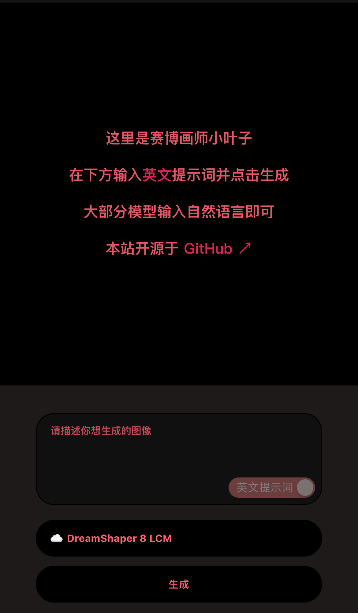
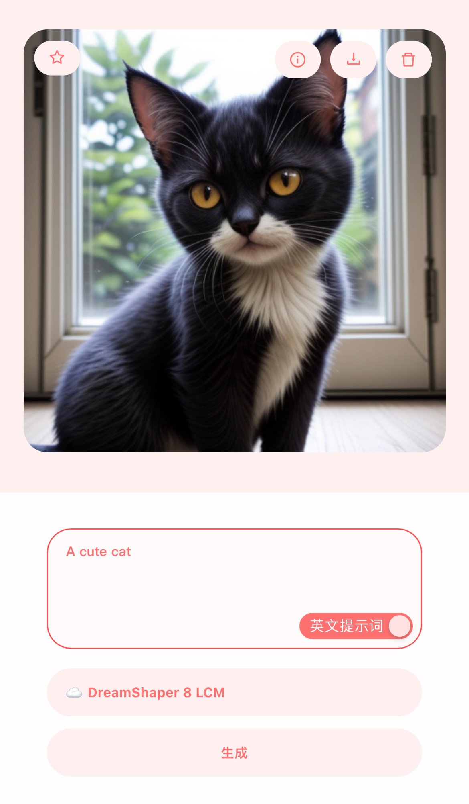
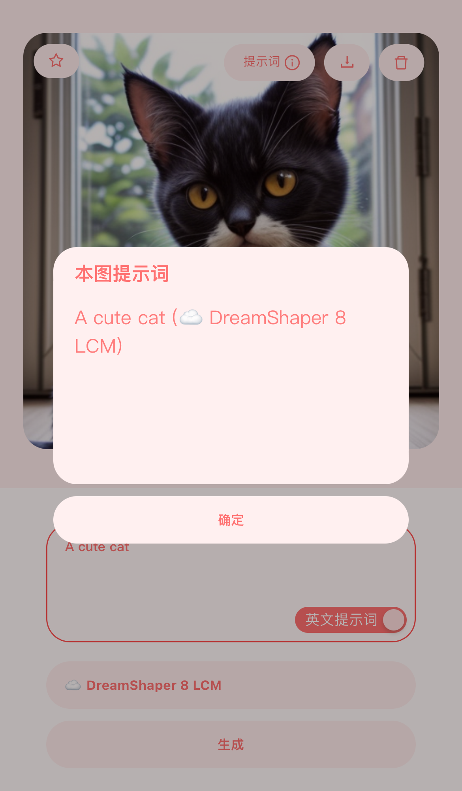

**[中文](README_ZH.md) | English**

# PainterLeaf
An `AI` image generation tool that supports Chinese and English (Chinese will automatically call the `AI` translation), adopts a front-end and back-end separation design, the front-end is based on the `React` framework, and can be deployed on static website hosting services such as `Cloudflare Pages` and `Vercel`, and the back-end is based on `Hono`, deployed on `Cloudflare Workers`, see [this project](https://github.com/LeafYeeXYZ/MyAPIs)

|||||
|:---:|:---:|:---:|:---:|

## Usage
### Modify src/config.json
```javascript
{
  "SERVER": "https://api.xxx.workers.dev", // Your server address
}
```

### Install dependencies
```bash
npm i -g pnpm
pnpm i
```

### Local run
```bash
pnpm dev
```

### Build
```bash
pnpm build
```
