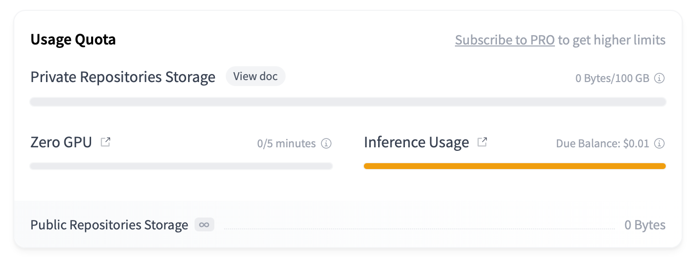

**Please deploy your own server cause mine exceeds the free plan limit.**

|  |  |
| :-----------------: | :-----------------: |

# Painter Leaf

A image creator based on **free** `Cloudflare AI` and `HuggingFace` APIs. Features include:

- Prompt-to-image: supports a variety of models (e.g. `Flux.1`、`StableDiffusion 3.5`)
- Image-to-Prompt: convert local images to prompts
- AI Translation: use Chinese prompts in any model
- Store: save your creations to `IndexedDB`


## 1 Deployment

### 1.1 Config Environment Variables

You can use either `Fullstack` or `Client-Server` mode and set the corresponding environment variables.

> You may need to initialize `Cloudflare AI` `llama3.2 11B vision` model before using `Image-to-Prompt` feature. See [here](https://developers.cloudflare.com/workers-ai/models/llama-3.2-11b-vision-instruct/) for more information.

#### 1.1.1 Fullstack

Set following environment variables in `.env` file or `Vercel`.

|       Key       |          Value          | Required |
| :-------------: | :---------------------: | :------: |
|  `CF_USER_ID`   |  `Cloudflare` user id   |    ✅    |
| `CF_AI_API_KEY` | `Cloudflare AI` api key |    ✅    |
|  `HF_API_KEY`   |  `HuggingFace` api key  |          |

> The free plan of `Vercel` has a limit of 10s for each request, which may cause `504` error (especially when using `HuggingFace` models). You can subscribe to a `Vercel` paid plan, run the server locally, or use `Client-Server` mode. <span id="vervel-limit-resolution"></span>

#### 1.1.2 Client-Server

Deploy the server (see [this project](https://github.com/LeafYeeXYZ/MyAPIs)) to `Cloudflare Workers` and set following environment variables in `.env` file or `Vercel`.

|             Key              |                       Value                       | Required |
| :--------------------------: | :-----------------------------------------------: | :------: |
| `NEXT_PUBLIC_WORKERS_SERVER` | `Server` url (e.g. `https://api.xxx.workers.dev`) |    ✅    |

> Once `NEXT_PUBLIC_WORKERS_SERVER` is set, all the other environment variables will be ignored.

### 1.2 Deploy to Vercel

Deploy this project to `Vercel` (remember to set environment variables when deploying).

### 1.3 Common Issues

- `429` error: You may have exceeded the `HuggingFace` api request limit. Please wait for a while, reduce the frequency of requests, and consider subscribing to a paid plan.
- `504` error: The request may have exceeded the `Vercel` time limit. See [above](#vervel-limit-resolution) for resolution.

## 2 Development

> **For old version, see `v3` branch and <https://paint.leafyee.xyz>**

### 2.1 Clone the repository

```bash
git clone https://github.com/LeafYeeXYZ/PainterLeaf.git
cd PainterLeaf
```

### 2.2 Install dependencies

```bash
bun install # or use other package manager you like
```

### 2.3 Local Development

```bash
bun run dev
```

### 2.4 Build

```bash
bun run build
```
