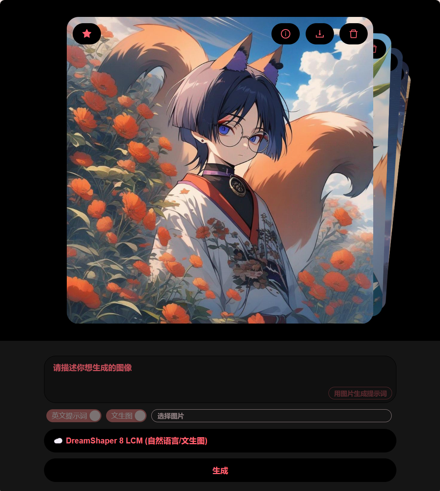

**中文 | [English](README.md)**

# 赛博画师小叶子
- 文生图, 支持多种模型
- 图生文, 将本地图片转为提示词
- 也支持图生图
- 提示词支持中英双语 (中文将自动调用 `AI` 翻译)
- 前后端分离, 前端基于 `React`, 后端基于 `Hono`, 见[这个项目](https://github.com/LeafYeeXYZ/MyAPIs)
- 使用 `CloudflareAI` 和 `HuggingFace` 提供的 `API`

|||
|:---:|:---:|

## 使用方法
### 修改配置
```javascript
// 修改 src/config.json
{
  "SERVER": "https://api.xxx.workers.dev", // 你的服务器地址
}
```

### 安装依赖
```bash
npm i -g pnpm
pnpm i
```

### 本地运行
```bash
pnpm dev
```

### 打包
```bash
pnpm build
```