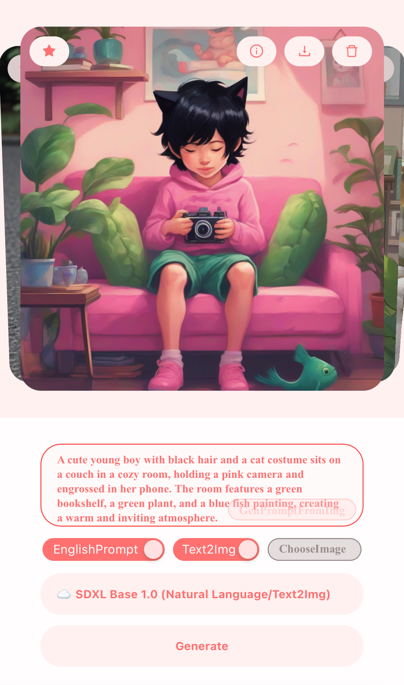
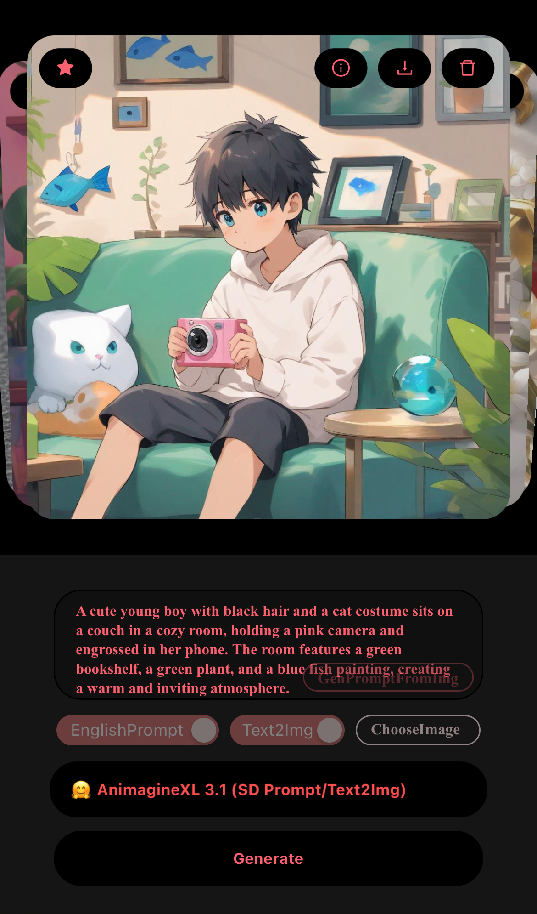

**[简体中文](README_ZH_CN.md) | 正體中文 | [English](README.md)**

# PainterLeaf
- 文生圖, 支持多種模型
- 圖生文, 將本地圖片轉為提示詞
- 也支持圖生圖
- 提示詞支持中英雙語 (中文將自動調用 `AI` 翻譯)
- 前後端分離, 前端基於 `React`, 後端基於 `Hono`, 見[這個項目](https://github.com/LeafYeeXYZ/MyAPIs)
- 使用 `CloudflareAI` 和 `HuggingFace` 提供的 `API`
- 國際化支持, 目前支持 `簡體中文`, `正體中文`, `英文`

|||
|:---:|:---:|
|||

## 使用方法
### 部署伺服器
見[這個項目](https://github.com/LeafYeeXYZ/MyAPIs)

### 設置伺服器地址
在 `.env` 文件, `Vercel` 或 `Cloudflare Pages` 中設置 `VITE_SERVER` 環境變量, 如 `https://api.xxx.workers.dev`

### 安裝 Bun
請參考 [Bun.sh](https://bun.sh). 或直接運行 `npm i -g bun`

### 安裝依賴
```bash
bun i
```

### 本地運行
```bash
bun run dev
```

### 打包
```bash
bun run build
```
